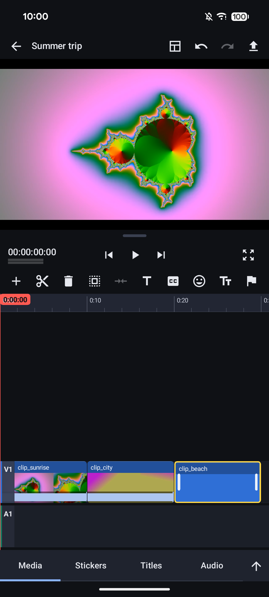
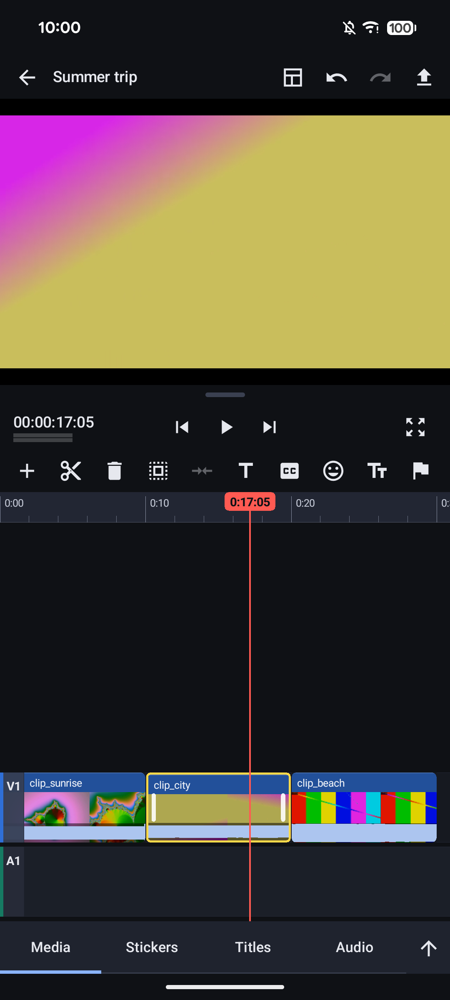

# ultimateVE

A lightweight, high-performance video editor for Android, aimed at creators who edit for YouTube and short-form
platforms. It pairs a LumaFusion-style multitrack timeline (a magnetic base track with free overlays) with CapCut-style
quick-edit tools. Native Android: Kotlin + Jetpack Compose for the UI, a C++ engine (NDK) for decoding, compositing,
timeline rendering, audio and export.

Licensed under [GPL-3.0](LICENSE). Third-party components are listed in [THIRD_PARTY_NOTICES.md](THIRD_PARTY_NOTICES.md).

<p align="center">
  &nbsp;
  
</p>
<p align="center"><sub>Screenshots use synthetic test clips.</sub></p>

> **Status: feature complete for the first release, little time on real phones.** Every work package of the plan is implemented and
> covered by automated tests (about 2,000 JVM tests and 13 native host test programs, run in CI). Most of the newer features have
> never been seen on a phone, and nothing has been exercised with real footage beyond a few clips. The checklist to walk through on
> the reference phone is the [Verification debt](PLAN.md#verification-debt) table in `PLAN.md`.

## What it does

- **Editing:** multitrack timeline with a magnetic base track and free overlay lanes (LumaFusion-style), split, trim, move,
  overwrite, insert, ripple delete, undo/redo, multiselect with group move/copy/paste, snapping, markers, beat detection and "cut to beat",
  a media tray with drag and drop, a library with tags and search, and a layout you can resize and dock.
- **Picture:** H.264/HEVC hardware decode, a GLES 3.2 compositor with multiple layers, transforms and keyframes on any parameter,
  speed ramps, reverse, freeze, optical-flow slow motion, effects, masks, blend modes, chroma key, colour grading with scopes,
  3D LUTs, 20 built-in looks, stabilisation, motion tracking, denoise and deflicker, HDR (HLG) end to end.
- **Titles and graphics:** multilayer titles (text, shapes, pictures) with imported fonts and shareable presets, text templates, eight
  animated caption styles with `.srt`/`.vtt` import, stickers and photos, nine transitions.
- **Sound:** Oboe playback with the audio clock as master, pan, fades, EQ, noise suppression (classical DSP), loudness normalise,
  track mixer, auto-ducking and meters.
- **Productivity:** project templates with placeholders, silence-based auto cut, reframe helper for vertical video, multicam
  (sync by sound, cut between up to six cameras), proxy media for heavy footage, project bundles, EDL and FCPXML export.
- **Export:** H.264/HEVC (HEVC Main10 for HLG) with AAC, upload presets, progress with time left, cancel and share.
- **Safety:** missing-media relink, `.bak` recovery, autosave errors surfaced, local-only crash report.

| Area | State |
|---|---|
| Project hub: create, clone, rename, delete, import/export (JSON, atomic writes) | Implemented; JVM-tested. Seen on the device |
| Multitrack timeline: split, move, trim, overwrite, ripple delete, undo/redo | Implemented; heavily unit-tested (collisions, gaps, randomized invariants) |
| Magnetic base track with overlays that follow it (delete, insert, reorder, trim) | Implemented; unit-tested. Not yet verified by touch on the device |
| Native timeline canvas (`SurfaceView`, GLES) with waveforms and thumbnail filmstrip | Seen on the device; frame rate not measured, pinch-zoom only host-tested |
| Preview: H.264/HEVC hardware decode to `AHardwareBuffer`, GLES 3.2 compositor, multilayer | Seen on the device with synthetic clips |
| Audio playback (Oboe) with the audio clock as master, per-clip gain | Clock drift measured over ~55 s; long-run A/V drift not yet measured; sound not listened to |
| Per-clip transform (position, scale, rotation, opacity), keyframes | One-finger edits seen on the device; pinch/twist and keyframes unit-tested only |
| Titles and crossfade transitions | Implemented; not seen on the device |
| Speed changes, ramps, reverse, freeze frame | Implemented; export checked frame by frame on the device, preview/UI not seen |
| Effects, chroma key, masks, blend modes | Implemented; shaders not yet seen on the device |
| Photos and built-in stickers as still clips (import images, sticker picker) | Implemented and unit-tested; not yet seen on the device (EXIF orientation, HEIC, sticker art unverified) |
| Social format presets, safe zones, upload presets | Implemented; not seen on the device |
| Ruler markers, beat detection (from the waveform cache), snap to markers, "Cut to beat" | Implemented and unit-tested (detector on synthetic click tracks); not tried on real music or on the device |
| Multilayer titles (text, shapes, pictures), imported fonts, in/out animation, shareable `.uvtitle` presets; the text templates are built on it | Layers, preview gestures, font import and animation seen on a Pixel 8; photo layers, export and the OPPO not yet |
| Captions: typed or imported from `.srt` / `.vtt`, 8 animated styles, restyle all (no speech recognition, fully offline) | Implemented and unit-tested; not yet seen on the device |
| HDR: HLG project colour space, HEVC Main10 export | Implemented; not seen on an HDR display |
| Export to MP4 (H.264 / HEVC + AAC), 4K60 HEVC at ~90 fps on the test phone | Verified with `ffprobe` on synthetic clips; cancel/share untested on device |

Optional and off by default: a software-decoding fallback built on FFmpeg ([docs/ffmpeg-fallback.md](docs/ffmpeg-fallback.md); verified in CI only). Not done yet: Vulkan renderer, pitch-preserving time stretch. The roadmap lives in [PLAN.md](PLAN.md); the reasoning behind choices in [DECISIONS.md](DECISIONS.md).

What has actually been seen working on a phone (the OPPO CPH2841 reference phone, plus a Pixel 8 used for debugging), and what has not,
is spelled out per area in [PLAN.md](PLAN.md#verification-debt). Highlights: exports were checked with `ffprobe` (exact frame counts,
4K60 HEVC at ~90 fps on the reference phone); the audio clock drifts under 0.4 ms in 55 s; scrolling and dragging in the editor were
exercised by hand. Not built: the FFmpeg fallback (designed in [docs/ffmpeg-fallback.md](docs/ffmpeg-fallback.md)) and voice effects.
A Vulkan renderer was evaluated and judged not worth it now ([docs/vulkan-evaluation.md](docs/vulkan-evaluation.md)).
The roadmap lives in [PLAN.md](PLAN.md); the reasoning behind choices in [DECISIONS.md](DECISIONS.md).

## Architecture

```
app/src/main/kotlin/com/ultimatevideo/uveditor/
  ui/         Compose screens: hub, editor (tray, layout, inspector, sheets), export, library, templates, about; never draws timeline clips
  mvi/        State / Intent / Effect base classes (StateFlow)
  domain/     Pure Kotlin timeline model, edit operations, undo/redo, render plan (no Android imports)
  data/       Project JSON, repository, media import, interchange (bundle, EDL, FCPXML), domain mapping
  engine/     Kotlin facades over the native engine (the only callers of JNI)
  proxy/ crash/   Proxy media manager, local crash report
app/src/main/cpp/
  core/ decode/ cache/ render/ encode/ audio/ thumbnail/ timeline_view/ stabilise/ track/ jni/   (C++20, library `uveditor_engine`)
```

- **MVI.** Each screen has an immutable `State`, a sealed `Intent` and one-shot `Effect`s. The editor keeps the timeline
  in its ViewModel and publishes immutable snapshots to the engine.
- **Integer time.** Every timeline position is an integer `FrameIndex`; the frame rate is rational. No floating-point
  seconds, so there is no A/V drift from rounding.
- **Two `SurfaceView`s.** The preview and the timeline canvas are drawn by C++/OpenGL ES, so scrubbing and scrolling do
  not trigger Compose recomposition.
- **Zero-copy frames.** Decoded frames live in `AHardwareBuffer`s shared with the GPU, in an LRU cache with a strict byte budget.
- **One render plan.** Preview, export and audio all consume `domain/RenderPlan.kt`, so what you see is what is exported.

Details: [docs/ARCHITECTURE.md](docs/ARCHITECTURE.md) (overview), [SPECS.md](SPECS.md) (technical), [PRD.md](PRD.md) (product), [CLAUDE.md](CLAUDE.md) (engineering rules).

## Requirements

- Android device with Android 12 or newer (minSdk 31); developed on a high-end phone (SM8850, Android 16).
- JDK 21, Android SDK with platform 37, NDK `29.0.14206865` and CMake `3.31.6`. Android Studio is not required.
- `git`. `g++` (C++20) for the host-side native tests.

## Setup (command line, Linux)

```sh
git clone https://github.com/qtekfun/UltimateVideoEditor.git
cd UltimateVideoEditor

export JAVA_HOME=/path/to/jdk-21
export ANDROID_HOME=$HOME/Android/Sdk      # command-line tools installed under $ANDROID_HOME/cmdline-tools/latest
sdkmanager --licenses
sdkmanager "platform-tools" "platforms;android-37.0" "ndk;29.0.14206865" "cmake;3.31.6"
```

On a busy machine use `nice -n 15 ./gradlew ... --max-workers=2`.

## Build, test, install

```sh
./gradlew :app:testDebugUnitTest          # JVM unit tests
./gradlew :app:assembleDebug              # app/build/outputs/apk/debug/app-debug.apk
scripts/run-native-tests.sh               # host-built C++ tests (g++ only)

# CMake host tests (needs cmake + ninja)
cmake -S app/src/main/cpp/tests -B build/uv-host -G Ninja
cmake --build build/uv-host && ctest --test-dir build/uv-host --output-on-failure

adb -s <serial> install -r app/build/outputs/apk/debug/app-debug.apk
adb -s <serial> shell am start -n com.ultimatevideo.uveditor/.MainActivity
```

CI runs the unit tests, the debug build and the native host tests on every pull request
(`.github/workflows/ci.yml`) and uploads the debug APK as an artifact.

### Release build

```sh
./gradlew :app:assembleRelease :app:bundleRelease   # R8-minified; unsigned unless a keystore is configured
```

The version lives in `gradle/version.properties`; signing values come from a git-ignored `keystore.properties` or
`UVEDITOR_*` environment variables, never from the repository. The `Release build` workflow (manual or on a `v*` tag)
builds the unsigned APK and AAB with checksums and the R8 mapping, and needs no secrets. Details, the store listing
text and the release checklist are in [docs/RELEASE.md](docs/RELEASE.md).

### Device notes

- **Wireless adb** can list the same phone under several transports (for example `...(2)._adb-tls-connect._tcp`).
  Always pass `adb -s <serial>`, and for Gradle use `ANDROID_SERIAL=<serial> ./gradlew ...`; otherwise installs fail.
- **Never run `connectedDebugAndroidTest` on a device whose app data you care about.** The instrumentation APK shares the
  app's package, and installing and uninstalling it **clears the app's data, including your projects**.
- The app needs no network: it declares no permissions, and `OfflineGuaranteeTest` keeps it that way.
- The screen must be unlocked to see the UI; check which app is in the foreground before sending `adb shell input`.

## Privacy

ultimateVE works entirely on the device: no network access, no accounts, no analytics, no crash-reporting service (a
crash only leaves a small text file on the phone that you can read, share or delete in About), no AI or
machine-learning features and no third-party services. See [docs/PRIVACY.md](docs/PRIVACY.md) for what is stored, which
permissions are used and how to verify it yourself.

## Using the app

See the [user guide](docs/USER_GUIDE.md) for the screens, every toolbar icon and the main gestures.

## Roadmap

[PLAN.md](PLAN.md) lists the phases with their gates and what is still open: walking the verification checklist on the reference
phone, the 5-minute A/V drift run, and the deferred items (frame blending for slow motion, pitch-preserving time stretch,
animated GIF/WebP, voice effects, the FFmpeg fallback). Everything stays offline and free of AI features.

## Contributing

See [CONTRIBUTING.md](CONTRIBUTING.md).

## License

GPL-3.0. See [LICENSE](LICENSE) and [THIRD_PARTY_NOTICES.md](THIRD_PARTY_NOTICES.md).
